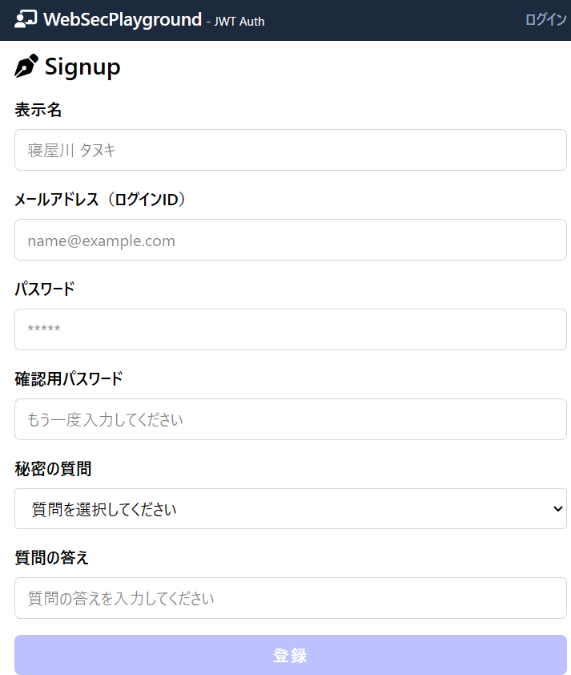

# トークンベース認証APP

## 概要

このプロジェクトは **ウェブアプリのセキュリティ実験用のコンテンツ** です。セキュリティに対する理解を深めるためにゼロからユーザ認証を実装した物になります。

## セットアップ手順

### 1. リポジトリのクローン

```
git clone https://github.com/akaumigame6/web-token-sec.git
cd web-token-sec
```

上記でクローンすると、カレントフォルダのなかに `web-token-sec` というフォルダが新規作成されて展開されます。別名にしたいときは、たとえば `hoge` というフォルダにクローンしたいときは、次のようにしてください。

```
git clone https://github.com/akaumigame6/web-token-sec.git hoge
cd hoge
```

### 2. 依存関係のインストール

```bash
npm i
```

### 3. 環境変数の設定ファイル (.env) の作成

プロジェクトのルートフォルダに `.env` (環境変数の設定ファイル) を新規作成して以下の内容を記述してください。

```
DATABASE_URL="file:./app.db"
JWT_SECRET=ABCDEFG123456789UVWXYZ
```

- `JWT_SECRET` は認証処理に必要な秘密キーです。安全性を確保するため、適当なランダムな英数字を用いた **16文字以上の文字列** に置き換えてください。文字数が不十分だと、動作時にエラーとなる可能性があります。


### 4. データベースの初期化

```bash
npx prisma db push
npx prisma generate
npx prisma db seed
```

### 5. 開発サーバの起動

```bash
npm run dev
```

### 6. ビルドと実行

```bash
npm run build
npm run start
```

- データベースの状態確認

```bash
npx prisma studio
```

## 技術スタック
### フロントエンド
- Next.js 15.3.3
  - React フレームワーク（App Router使用）
- TypeScript - 型安全性の確保
- TailwindCSS - レスポンシブデザイン

### バックエンド
- Next.js API Routes - サーバーサイドAPI
- Prisma ORM - データベース操作

### セキュリティ
- bcrypt - パスワードハッシュ化
- jose - JWT操作
- zod - バリデーション
- zxcvbn - パスワードの強度確認

## 主要機能

### 🔐 **認証・アカウント管理**
- **ユーザー登録**  
  
 - メールアドレス
 - パスワード
 - 秘密の質問
 での新規アカウント作成
- **ログイン・ログアウト**  

 - JWT（JSON Web Token）ベースの認証システム
- **パスワードリセット** 
 
 
 
 - メールアドレス＋秘密の質問による本人確認後のパスワード変更

### 👤 **プロフィール管理**
 
- **公開プロフィール作成**: カスタムURL（スラッグ）での個人ページ作成
- **プロフィール編集**: About情報のリアルタイム編集・プレビュー機能
- **アカウント設定**: 秘密の質問の変更（ログイン必須）

## 実装しているセキュリティ機能
### ユーザー登録・サインアップ
 
#### パスワードセキュリティ
- **パスワード強度表示**: zxcvbnライブラリによるリアルタイム強度評価
- **確認パスワード**: パスワード入力ミスを防ぐダブルチェック

#### 秘密の質問システム
 
- **本人確認用質問**: アカウント登録時に秘密の質問と答えを設定

#### 未ログイン状態でのパスワードリセット
- **メールアドレス認証**: パスワードリセット開始時にメールアドレスを入力
- **秘密の質問による本人確認**: メールアドレスに紐づく秘密の質問で認証
- **時間制限付きリセットトークン**: 10分間有効なワンタイムトークン

### アカウント設定変更機能
#### 秘密の質問更新（ログイン必須）
- **JWT認証必須**: ログインユーザーのみアクセス可能
- **現在パスワード確認**: パスワード検証による本人確認
- **即座反映**: 新しい秘密の質問設定は即座に有効化
- **外部アクセス防止**: 認証なしのAPIアクセスを完全ブロック
#### パスワードリセット機能(ログイン必須)
- **二重認証**: ログイン状態 + 秘密の質問回答の両方が必要
- **時間制限付きトークン**: 15分間のみ有効なパスワードリセット専用トークン
- **トークン目的検証**: `purpose: "password-reset"`による用途限定
- **ユーザーID照合**: JWTとリセットトークンのユーザーID一致確認

## セキュリティレベル評価

### ✅ **実装済みセキュリティ機能**
- **パスワードハッシュ化**: bcryptjs使用（ソルト付き）
- **JWT署名検証**: HMAC-SHA256による改竄防止
- **入力値検証**: Zodによる型安全なバリデーション
- **SQL インジェクション対策**: Prisma ORM による自動対策
- **認証必須API**: 重要操作での厳格なJWT検証

### ⚠️ **セキュリティ改善余地**
- **レート制限**: ブルートフォース攻撃対策が未実装
- **ログ・監査**: セキュリティイベントの記録機能なし
- **セッション管理**: JWTの強制失効機能なし
- **CSRF対策**: クロスサイトリクエストフォージェリ対策なし
- **XSS対策**: 出力エスケープの一部未対応

### 🔒 **本格運用時の追加推奨事項**
- **多要素認証（MFA）**: SMS/TOTP認証の追加
- **不正検知**: 異常なログインパターンの監視
- **セキュリティヘッダー**: CSP、HSTS等の設定
- **定期的パスワード変更**: パスワード有効期限の実装
- **暗号化通信**: HTTPS必須化とTLS1.3使用